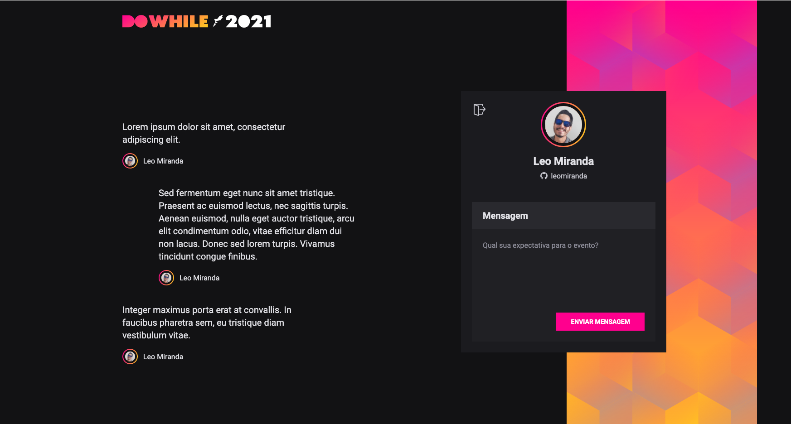

# DoWhile2021 NodeJS

<p align="center" >
    
</p>

# About The Project

The project is a `reactjs` frontend consuming a backend in `nodejs`.

The following technologies were used:

- [React.js](https://reactjs.org)
- [Vite.dev](https://vitejs.dev/)
- [TypeScript](https://www.typescriptlang.org/)
- [Sass](https://sass-lang.com/)
- [Axios](https://axios-http.com/)
- [Socket.io](https://socket.io/)

## Resources

- Real time connection for sending and receiving messages with `Socket.io`
- Authentication flow with `Github OAuth` and `JWT web token`

## Run the Project

Clone this project:

```bash
git clone https://github.com/leomiranda/dowhile2021-frontend-reactjs.git
cd dowhile2021-frontend-reactjs
```

### Clone, Configure and Run the backend

Configure a nodejs backend project (https://github.com/leomiranda/dowhile2021-backend-nodejs).

Now the backend server is running on [`localhost:4000`](http://localhost:4000).

###

Run `dev` script:

```bash
yarn
yarn dev
```

Now your server is running on [`localhost:3000`](http://localhost:3000).

Log In with your Github and add new messages.
